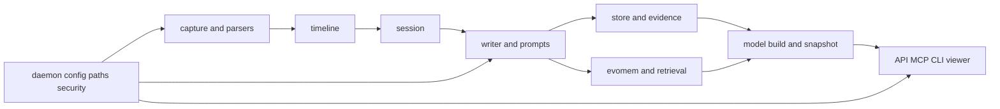

# Repository Map

## Purpose

This map gives coding agents and reviewers a stable view of module ownership,
canonical documentation, dependency boundaries, verification, and natural PR
slices. Read it before constructing a delivery PR dependency DAG.

The repository currently has no `CODEOWNERS` file. Ownership below names
reviewer roles rather than people. Use repository maintainers to resolve the
actual reviewer for a role.

## System dependency flow

Production state formation has one shared modeling entrance in
`src/persome/writer/agent.py`. No delivery slice may add a parallel session
modeling path.

## Module ownership and PR boundaries

### Capture and parsing

- Paths: `src/persome/capture/`, `src/persome/parsers/`, native AX resources,
  OCR resources.
- Responsibility: acquire screen context, enforce pixel policy, normalize AX
  and OCR evidence, and degrade safely.
- Reviewer role: capture, privacy, and macOS integration maintainers.
- Canonical docs: `docs/capture.md`, `SECURITY_PRIVACY.md`,
  `docs/runtime-internals.md`.
- Dependencies: may use configuration, paths, privacy, and store ingestion
  contracts; must not call writer or model synthesis stages.
- Verification: capture/parser tests, privacy scans, macOS-marked tests when
  real permissions are available.
- PR boundary: keep native permission behavior, Python normalization, tests,
  and matching capture/privacy docs together.

### Timeline and session formation

- Paths: `src/persome/timeline/`, `src/persome/session/`.
- Responsibility: one-minute timeline blocks, attention state, deterministic
  session cuts, and session persistence.
- Reviewer role: state-formation maintainers.
- Canonical docs: `docs/timeline.md`, `docs/session.md`,
  `docs/architecture.md`.
- Dependencies: consumes normalized capture and store primitives; must not
  project public model geometry directly.
- Verification: timeline and session unit tests plus runtime-model end-to-end
  tests when behavior changes.
- PR boundary: split deterministic cut logic from downstream modeling changes
  unless one acceptance criterion requires both.

### Writer, prompts, and memory formation

- Paths: `src/persome/writer/`, `src/persome/prompts/`.
- Responsibility: active reduction, memory delta, deterministic apply,
  classification, pattern detection, enrichment, and LLM routing.
- Reviewer role: modeling, prompt, and evidence maintainers.
- Canonical docs: `docs/writer.md`, `docs/prompt-engineering.md`,
  `docs/memory-formation-upgrade.md`.
- Dependencies: consumes sessions, timeline evidence, store, evomem, and the
  configured LLM boundary in `writer/llm.py`.
- Invariants: all stage LLM calls use `writer/llm.py`; all active, final,
  retry, recovery, and model-build paths share `writer/agent.py`.
- Verification: focused writer tests, synthetic LLM fixtures, formation golden
  tests, and runtime-model end-to-end tests.
- PR boundary: a prompt behavior change includes its synthetic regression
  fixture and reportable criterion in the same slice.

### Storage, evidence, and provenance

- Paths: `src/persome/store/`, `src/persome/evidence.py`,
  `src/persome/integrity.py`, committed schema artifacts.
- Responsibility: SQLite/Markdown authority, FTS, bitemporal evidence,
  provenance, projection, and integrity.
- Reviewer role: storage and provenance maintainers.
- Canonical docs: `docs/db-schema.sql`, `docs/model-contract.md`,
  `SECURITY_PRIVACY.md`.
- Dependencies: low-level modules may not depend on CLI, API presentation, or
  product-specific behavior.
- Invariants: SQLite access uses `with fts.cursor() as conn:`; tests use an
  isolated data root.
- Verification: store tests, migration/integrity tests, schema regeneration,
  and drift tests.
- PR boundary: schema behavior and regenerated schema contract stay together.

### Evomem and retrieval

- Paths: `src/persome/evomem/`, `src/persome/retrieval/`.
- Responsibility: evolutionary memory chains, reconciliation, relations,
  vector recall, and associative retrieval.
- Reviewer role: memory graph and retrieval maintainers.
- Canonical docs: `docs/memory-format.md`, `MODEL_FORMAT.md`,
  `docs/model-contract.md`.
- Dependencies: may consume store and evidence contracts; must preserve source
  receipts and temporal semantics.
- Verification: evomem tests, inversion equivalence harness, retrieval tests,
  and model snapshot consumers.
- PR boundary: retrieval tuning and graph mutation should be separate unless a
  frozen end-to-end fixture proves their combined contract.

### Model construction and snapshot

- Paths: `src/persome/model/`, structural synthesis stages under
  `src/persome/writer/`.
- Responsibility: Points, Lines, Faces, Volumes, Root, build manifest, raw
  human view, and versioned snapshot.
- Reviewer role: model-contract maintainers.
- Canonical docs: `MODEL_FORMAT.md`, `docs/model-contract.md`,
  `ARCHITECTURE.md`.
- Dependencies: reads durable modeled state; must not fabricate missing
  geometry or bypass build coordination.
- Verification: model tests, snapshot golden, build degradation tests, and
  contract consumers.
- PR boundary: snapshot shape changes include contract docs, golden updates,
  and compatibility tests in one PR.

### Public API, MCP, and security

- Paths: `src/persome/api/`, `src/persome/mcp/`,
  `src/persome/security/`.
- Responsibility: loopback HTTP, viewer, REST, MCP tools, owner-local
  authentication, limits, and redaction.
- Reviewer role: public-contract and security maintainers.
- Canonical docs: `MCP.md`, `docs/mcp.md`, `docs/api.md`,
  `SECURITY_PRIVACY.md`, `openapi.json`.
- Dependencies: consumes model, store, capture-ingest, and security contracts;
  must not introduce unauthenticated personal-data surfaces.
- Verification: API/MCP tests, authentication tests, transport smoke, OpenAPI
  regeneration, and drift tests.
- PR boundary: public behavior, generated contract, security tests, and public
  docs stay together.

### Runtime, configuration, and operations

- Paths: `src/persome/cli.py`, `daemon.py`, `config.py`, `paths.py`,
  onboarding, launch agent, updater, doctor, and runtime PID modules.
- Responsibility: install, configuration, daemon ownership, lifecycle,
  readiness, update/rollback, and command routing.
- Reviewer role: runtime and release maintainers.
- Canonical docs: `README.md`, `VALIDATION.md`, `docs/config.md`,
  `docs/runtime-internals.md`, `ARCHITECTURE.md`.
- Dependencies: coordinates domain services but must keep path authority in
  `paths.py` and preserve owner-local secrets.
- Verification: CLI/runtime tests, package smoke, updater tests, shell syntax,
  and release validation.
- PR boundary: avoid mixing runtime lifecycle changes with unrelated modeling
  behavior.

### Native helpers, assets, and connectors

- Paths: `resources/`, `ocr_models/`, `connectors/`.
- Responsibility: compiled macOS helpers, local OCR assets, model viewer
  assets, and explicit companion connectors.
- Reviewer role: native, frontend-asset, or connector maintainers.
- Canonical docs: `docs/capture.md`, `docs/model-contract.md`,
  connector-local documentation, legal notices.
- Dependencies: bundled artifacts must remain reproducible and correctly
  attributed.
- Verification: shell syntax, Swift tests/builds, model-asset tests, wheel
  content smoke, and legal/license checks.
- PR boundary: vendored asset changes include build recipe, integrity checks,
  attribution, and consumer tests.

### Compound-engineering delivery infrastructure

- Paths: `docs/ai-delivery-sop.md`, `.claude/skills/deliver/`,
  `.githooks/`, `Makefile`, `templates/compound-engineering/`,
  `scripts/bootstrap_compound_engineering.py`, goal documents.
- Responsibility: durable delivery context, worktree lane discipline, PR
  policy, unified verification, bootstrap, and metrics.
- Reviewer role: repository maintainers and developer-experience maintainers.
- Canonical docs: this map, `docs/ai-delivery-sop.md`, `AGENTS.md`,
  `CONTRIBUTING.md`.
- Dependencies: may invoke repository tooling but must not be imported by the
  Persome runtime package.
- Verification: focused compound-engineering tests, shell syntax, bootstrap
  idempotency, language/privacy scans, and `make check`.
- PR boundary: keep portable behavior separate from Persome-local policy with
  explicit template placeholders and local sections.

## PR DAG rules

1. Start with the acceptance criteria and map each criterion to owning modules.
2. Split independent reviewer roles into independent PR nodes when the public
   contract remains coherent.
3. Add dependency edges for shared schema, generated contracts, or foundations
   consumed by later slices.
4. Keep behavior, tests, and canonical documentation in the same node.
5. Keep generated artifacts with their source change.
6. Do not parallelize nodes that write the same contract or require an
   unmerged predecessor.
7. Use separate worktrees for independent nodes and record lane checkpoints in
   the goal document.
8. Re-run downstream checks when an integrated predecessor invalidates a lane's
   base assumptions.

## Verification map

- Full offline gate: `make check`
- Focused compound-engineering gate: `make check-harness`
- Contract regeneration:
  `uv run python scripts/regen_openapi.py` and
  `uv run python scripts/regen_db_schema.py`
- Contract drift:
  `uv run pytest tests/test_openapi_drift.py tests/test_db_schema_drift.py -q`
- Model assets: `npm run test:model-assets`
- macOS and live-provider checks remain explicit, permissioned, and outside the
  default offline gate.
